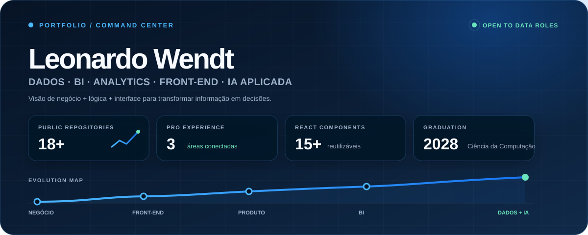

<div align="center">



[](https://ifwendt.github.io)
[](https://www.linkedin.com/in/leonardo-wendt)
[](https://raw.githubusercontent.com/IfWendt/ifwendt.github.io/main/Leonardo-Wendt-CV.pdf)
[](https://www.google.com/maps/search/Novo+Hamburgo+RS)

</div>

## `01 / PERFIL`

<table>
<tr>
<td width="58%" valign="top">

### Tecnologia com visão de negócio

Sou estudante de **Ciência da Computação** e construo minha trajetória na interseção entre **Dados, BI, Analytics, IA e desenvolvimento de interfaces**.

Minha experiência em faturamento, processos administrativos e produto digital me ensinou a enxergar o fluxo completo: entender o problema, organizar a informação, construir a solução e comunicar o resultado com clareza.

> Transformo dados e lógica em decisões, automações e experiências digitais úteis.

</td>
<td width="42%" valign="top">

### Radar atual

```text
FOCO        Dados · BI · Analytics
ANÁLISE     SQL · Power BI · Excel
AUTOMAÇÃO   Python · IA aplicada
PRODUTO     React · JavaScript · APIs
STATUS      Aberto a oportunidades
```

</td>
</tr>
</table>

## `02 / COMMAND CENTER`

<div align="center">


</div>

## `03 / STACK MAP`

<div align="center">

### Dados, BI & automação


### Front-end & produto


</div>

## `04 / SELECTED BUILDS`

<table>
<tr>
<td width="50%" valign="top">

### [Portfolio Dashboard](https://ifwendt.github.io) `LIVE`

Portfólio profissional com linguagem visual de dashboard, narrativa de carreira, filtros de projetos e experiência responsiva.

`HTML` `CSS` `JavaScript` `Design System`

</td>
<td width="50%" valign="top">

### [Mtrek](https://github.com/IfWendt/mtrek-new) `WEB`

Projeto multipágina com formulários, componentes reutilizáveis, navegação estruturada e integração de experiências web.

`Front-end` `Componentes` `Produto`

</td>
</tr>
<tr>
<td width="50%" valign="top">

### [Pokédex](https://github.com/IfWendt/pokedex) `INTERFACE`

Experiência temática que organiza dados e interação em uma interface clara, responsiva e orientada a JavaScript.

`JavaScript` `UI` `Consumo de dados`

</td>
<td width="50%" valign="top">

### [Space Invaders](https://github.com/IfWendt/Space-Invaders) `LOGIC`

Jogo no navegador que combina eventos, regras, estados e lógica para construir uma experiência interativa completa.

`Game loop` `Eventos` `Algoritmos`

</td>
</tr>
</table>

<div align="center">

<a href="https://github.com/IfWendt/mtrek-new"></a>
<a href="https://github.com/IfWendt/pokedex"></a>

</div>

## `05 / TRAJETÓRIA`

| Período | Experiência | Impacto |
|---|---|---|
| **2024 → atual** | **CRECI-RS · Administrativo** | Fluxos operacionais, triagem documental e integridade de informações cadastrais. |
| **2022 → atual** | **Hamburgo Plast · Faturamento** | Pedidos, notas fiscais, dados de vendas e integração entre administração e logística. |
| **2023 → 2024** | **Mtrek · Front-end** | Interfaces em React/JavaScript, APIs REST e mais de 15 componentes reutilizáveis. |
| **2024 → 2028** | **Ciência da Computação · Estácio** | Formação em lógica, software, dados e fundamentos computacionais. |

## `06 / PRÓXIMO NÍVEL`

<table>
<tr>
<td width="70%" valign="middle">

### Dados melhores começam com boas perguntas.

Busco oportunidades em **Dados e Analytics** onde eu possa conectar tecnologia, operação e negócio — transformando informação em decisões claras e soluções que funcionam.

</td>
<td width="30%" align="center" valign="middle">

[](https://www.linkedin.com/in/leonardo-wendt)

[](https://ifwendt.github.io)

</td>
</tr>
</table>

<div align="center">

<sub>DESIGNED AS A DATA PRODUCT · LEONARDO WENDT · 2026</sub>

</div>
